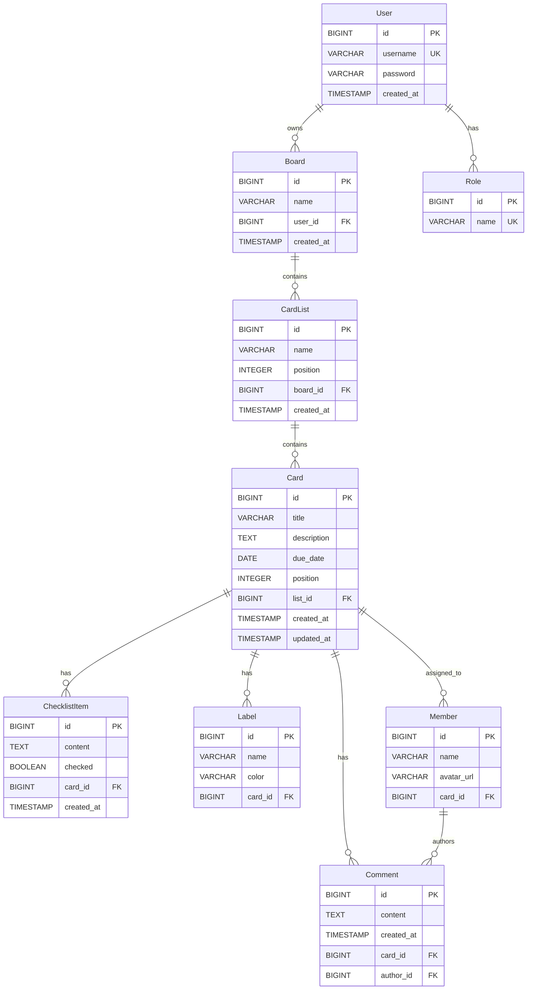

# Mello - Full-Stack Task Management Application

## Overview

Mello is a comprehensive task management application inspired by Trello, built with a Spring Boot backend and Next.js frontend. It provides a complete Kanban-style project management solution with boards, lists, cards, and rich task management features including checklists, comments, labels, and team collaboration tools.

## Features

### 🎯 Core Functionality
- **User Authentication** - JWT-based authentication with secure login/signup
- **Board Management** - Create and manage multiple project boards
- **List Organization** - Organize tasks within boards using customizable lists
- **Card Management** - Create, update, and organize task cards with rich features
- **Drag & Drop** - Intuitive drag-and-drop interface for reordering cards and moving between lists

### 📋 Task Management
- **Checklist Items** - Add detailed checklists to cards for task breakdown
- **Comments System** - Real-time collaboration through card comments
- **Labels & Tags** - Categorize cards with color-coded labels (auto-colors for "urgent" and "done")
- **Due Dates** - Set and track task deadlines
- **Card Details** - Rich card detail view with all task information

### 👥 Collaboration
- **Member Assignment** - Assign team members to specific cards
- **Real-time Updates** - Live updates across all connected clients
- **Role-based Access** - User and admin role management

### 🎨 User Experience
- **Modern UI** - Clean, responsive design with Tailwind CSS
- **Interactive Animations** - Smooth transitions and hover effects
- **Mobile Responsive** - Works seamlessly on desktop and mobile devices
- **Grid Background** - Beautiful animated grid backgrounds

## Technology Stack

### Backend
- **Framework**: Spring Boot 3.5.3
- **Database**: PostgreSQL
- **Security**: Spring Security with JWT
- **ORM**: Spring Data JPA with Hibernate
- **Build Tool**: Maven 3.9.10
- **Java Version**: 17

### Frontend
- **Framework**: Next.js 14+ (App Router)
- **Styling**: Tailwind CSS
- **UI Components**: Radix UI + shadcn/ui
- **Drag & Drop**: React DnD
- **Icons**: Lucide React
- **State Management**: React Hooks

## Project Structure

```
mello/
├── Backend/                    # Spring Boot Backend
│   ├── src/main/java/com/yourpackage/mello/
│   │   ├── config/            # Configuration classes
│   │   ├── controller/        # REST controllers
│   │   ├── dto/              # Data Transfer Objects
│   │   ├── mapper/           # Entity-DTO mappers
│   │   ├── model/            # JPA entities
│   │   ├── repository/       # Data repositories
│   │   ├── security/         # Security & JWT
│   │   └── service/          # Business logic
│   └── src/main/resources/
│       └── application.properties
│
└── Frontend/                   # Next.js Frontend
    ├── src/
    │   ├── app/
    │   │   ├── auth/          # Authentication pages
    │   │   │   ├── login/
    │   │   │   └── signup/
    │   │   ├── boards/        # Board management
    │   │   │   └── [id]/      # Dynamic board pages
    │   │   ├── globals.css
    │   │   ├── layout.js
    │   │   └── page.js        # Landing page
    │   └── components/
    │       └── ui/            # Reusable UI components
    └── package.json
```

## Database Design

### Entity Relationship Diagram



### Database Tables

#### Core Tables

##### users
```sql
CREATE TABLE users (
    id BIGSERIAL PRIMARY KEY,
    username VARCHAR(255) UNIQUE NOT NULL,
    password VARCHAR(255) NOT NULL,
    created_at TIMESTAMP DEFAULT CURRENT_TIMESTAMP
);
```

##### roles
```sql
CREATE TABLE roles (
    id BIGSERIAL PRIMARY KEY,
    name VARCHAR(50) UNIQUE NOT NULL
);
```

##### user_roles (Many-to-Many)
```sql
CREATE TABLE user_roles (
    user_id BIGINT REFERENCES users(id) ON DELETE CASCADE,
    role_id BIGINT REFERENCES roles(id) ON DELETE CASCADE,
    PRIMARY KEY (user_id, role_id)
);
```

##### board
```sql
CREATE TABLE board (
    id BIGSERIAL PRIMARY KEY,
    name VARCHAR(255) NOT NULL,
    user_id BIGINT NOT NULL REFERENCES users(id) ON DELETE CASCADE,
    created_at TIMESTAMP DEFAULT CURRENT_TIMESTAMP
);
```

##### card_list
```sql
CREATE TABLE card_list (
    id BIGSERIAL PRIMARY KEY,
    name VARCHAR(255) NOT NULL,
    position INTEGER DEFAULT 0,
    board_id BIGINT NOT NULL REFERENCES board(id) ON DELETE CASCADE,
    created_at TIMESTAMP DEFAULT CURRENT_TIMESTAMP
);
```

##### card
```sql
CREATE TABLE card (
    id BIGSERIAL PRIMARY KEY,
    title VARCHAR(255) NOT NULL,
    description TEXT,
    due_date DATE,
    position INTEGER DEFAULT 0,
    list_id BIGINT NOT NULL REFERENCES card_list(id) ON DELETE CASCADE,
    created_at TIMESTAMP DEFAULT CURRENT_TIMESTAMP,
    updated_at TIMESTAMP DEFAULT CURRENT_TIMESTAMP
);
```

#### Feature Tables

##### checklist_item
```sql
CREATE TABLE checklist_item (
    id BIGSERIAL PRIMARY KEY,
    content TEXT NOT NULL,
    checked BOOLEAN DEFAULT FALSE,
    card_id BIGINT NOT NULL REFERENCES card(id) ON DELETE CASCADE,
    created_at TIMESTAMP DEFAULT CURRENT_TIMESTAMP
);
```

##### member
```sql
CREATE TABLE member (
    id BIGSERIAL PRIMARY KEY,
    name VARCHAR(255) NOT NULL,
    avatar_url VARCHAR(500),
    card_id BIGINT REFERENCES card(id) ON DELETE CASCADE
);
```

##### comment
```sql
CREATE TABLE comment (
    id BIGSERIAL PRIMARY KEY,
    content TEXT NOT NULL,
    created_at TIMESTAMP DEFAULT CURRENT_TIMESTAMP,
    card_id BIGINT NOT NULL REFERENCES card(id) ON DELETE CASCADE,
    author_id BIGINT REFERENCES member(id) ON DELETE SET NULL
);
```

##### label
```sql
CREATE TABLE label (
    id BIGSERIAL PRIMARY KEY,
    name VARCHAR(100) NOT NULL,
    color VARCHAR(7) DEFAULT '#808080',
    card_id BIGINT NOT NULL REFERENCES card(id) ON DELETE CASCADE
);
```

### Key Database Relationships

1. **User to Board**: One-to-Many (Each user owns multiple boards)
2. **Board to CardList**: One-to-Many (Each board contains multiple lists)
3. **CardList to Card**: One-to-Many (Each list contains multiple cards)
4. **Card to Features**: One-to-Many relationships with checklist items, comments, labels, and members

## API Endpoints

### Authentication
- `POST /api/auth/login` - User login (returns JWT)
- `POST /api/auth/signup` - User registration

### Boards
- `GET /api/boards` - Get all user boards
- `GET /api/boards/{id}` - Get board by ID with lists and cards
- `POST /api/boards` - Create new board
- `PUT /api/boards/{id}` - Update board
- `DELETE /api/boards/{id}` - Delete board

### Lists
- `POST /api/lists` - Create new list
- `DELETE /api/lists/{id}` - Delete list

### Cards
- `POST /api/cards` - Create new card
- `PUT /api/cards/{id}` - Update card
- `PUT /api/cards/reorder` - Reorder cards (drag & drop)
- `DELETE /api/cards/{id}` - Delete card

### Checklist Items
- `GET /api/checklist/card/{cardId}` - Get checklist items for card
- `POST /api/checklist` - Create checklist item
- `PUT /api/checklist/{id}` - Update checklist item
- `DELETE /api/checklist/{id}` - Delete checklist item

### Comments
- `GET /api/comments/card/{cardId}` - Get comments for card
- `POST /api/comments` - Create comment

### Labels
- `GET /api/labels/card/{cardId}` - Get labels for card
- `POST /api/labels` - Create label (auto-colors for "done"=green, "urgent"=red)
- `DELETE /api/labels/{id}` - Delete label

### Members
- `GET /api/members/card/{cardId}` - Get members for card
- `POST /api/members` - Assign member to card

## Frontend Pages & Components

### Pages
- **Landing Page** (`/`) - Hero page with call-to-action
- **Login** (`/auth/login`) - User authentication
- **Signup** (`/auth/signup`) - User registration
- **Boards List** (`/boards`) - Display all user boards
- **Board Detail** (`/boards/[id]`) - Individual board with lists and cards

### Key Components
- **DragCard** - Draggable card component with React DnD
- **CardDetailsSheet** - Side panel for detailed card management
- **UI Components** - Complete shadcn/ui component library

## Setup Instructions

### Prerequisites
- Java 17 or higher
- Node.js 18+ and npm
- PostgreSQL database
- Maven 3.6+

### Backend Setup

1. **Navigate to backend directory**
   ```bash
   cd Backend/mello
   ```

2. **Configure Database**
   Update `src/main/resources/application.properties`:
   ```properties
   # Database Configuration
   spring.datasource.url=jdbc:postgresql://localhost:5432/mello
   spring.datasource.username=your_username
   spring.datasource.password=your_password
   
   # JWT Configuration
   jwt.secret=your-secure-secret-key-here-make-it-long-and-secure
   jwt.expiration=86400000
   
   # Hibernate
   spring.jpa.hibernate.ddl-auto=update
   spring.jpa.show-sql=true
   ```

3. **Run Backend**
   ```bash
   # Using Maven wrapper
   ./mvnw spring-boot:run
   
   # Or using Maven
   mvn spring-boot:run
   ```

4. **Verify Backend**
   - API will be available at `http://localhost:8080`
   - Test endpoint: `GET http://localhost:8080/hello`

### Frontend Setup

1. **Navigate to frontend directory**
   ```bash
   cd Frontend/mello
   ```

2. **Install Dependencies**
   ```bash
   npm install
   ```

3. **Configure Environment**
   Create `.env.local`:
   ```env
   NEXT_PUBLIC_API_URL=http://localhost:8080
   ```

4. **Run Frontend**
   ```bash
   npm run dev
   ```

5. **Access Application**
   - Frontend will be available at `http://localhost:3000`
   - Backend API at `http://localhost:8080`

### Database Migration

The application uses Hibernate DDL auto-generation. On first run, it will:
- Create all necessary tables
- Initialize default roles (USER, ADMIN)
- Set up proper foreign key relationships

## Features in Detail

### Authentication Flow
1. User signs up via `/auth/signup`
2. User logs in via `/auth/login` receiving JWT token
3. Client stores JWT in localStorage
4. Client includes JWT in Authorization header: `Bearer <token>`
5. Server validates token for all protected endpoints

### Drag & Drop System
- Powered by React DnD with HTML5 backend
- Cards can be reordered within lists
- Cards can be moved between lists
- Changes persist to backend via API calls
- Optimistic UI updates for smooth experience

### Label System
- Cards can have color-coded labels
- Special auto-coloring: "done" labels are green, "urgent" labels are red
- Labels provide visual card categorization
- Easy label creation and deletion

### Real-time Features
- Card updates reflect immediately in UI
- Checklist item toggling persists instantly
- Comments display in chronological order
- Board state syncs across sessions

### Responsive Design
- Mobile-first approach with Tailwind CSS
- Adaptive layouts for different screen sizes
- Touch-friendly interface for mobile devices
- Consistent design system with shadcn/ui

## Security

### Authentication & Authorization
- JWT-based stateless authentication
- Role-based access control (USER, ADMIN)
- Password hashing with BCrypt
- Secure token validation on all protected endpoints

### Data Protection
- SQL injection prevention via JPA/Hibernate
- XSS protection through proper data sanitization
- CORS configuration for cross-origin requests
- Input validation on both client and server

## Deployment

### Backend Deployment (Railway)
The application is pre-configured for Railway deployment:

```properties
# Railway PostgreSQL Configuration
spring.datasource.url=jdbc:postgresql://tramway.proxy.rlwy.net:31656/railway?sslmode=require
spring.datasource.username=postgres
spring.datasource.password=bBVetZDtWwulvFOPoMKRMYewpqSyyeHD
```

### Frontend Deployment (Vercel/Netlify)
1. Build the application: `npm run build`
2. Deploy to your preferred platform
3. Configure environment variables for production API URL

### Docker Deployment (Alternative)

**Backend Dockerfile:**
```dockerfile
FROM openjdk:17-jdk-slim
COPY target/mello-0.0.1-SNAPSHOT.jar app.jar
EXPOSE 8080
ENTRYPOINT ["java","-jar","/app.jar"]
```

**Frontend Dockerfile:**
```dockerfile
FROM node:18-alpine
WORKDIR /app
COPY package*.json ./
RUN npm ci
COPY . .
RUN npm run build
EXPOSE 3000
CMD ["npm", "start"]
```

## Development

### Adding New Features

#### Backend Development
1. Create Entity in `model/` package
2. Create Repository in `repository/` package
3. Create DTOs in `dto/` package
4. Create Mapper in `mapper/` package
5. Create Service in `service/` package
6. Create Controller in `controller/` package

#### Frontend Development
1. Create page component in `app/` directory
2. Add necessary UI components
3. Implement API integration
4. Add proper TypeScript types (if using TypeScript)

### Testing

#### Backend Testing
```bash
# Run all tests
./mvnw test

# Run specific test
./mvnw test -Dtest=AuthControllerTest
```

#### Frontend Testing
```bash
# Run tests (if configured)
npm test

# Run linting
npm run lint
```

## Performance Optimizations

### Backend
- Connection pooling for database connections
- Lazy loading for JPA relationships
- Query optimization with @Query annotations
- Caching strategies for frequently accessed data

### Frontend
- Next.js App Router for optimal performance
- Component-level code splitting
- Image optimization with Next.js
- Client-side caching of API responses

## Browser Compatibility

- **Modern Browsers**: Chrome 88+, Firefox 85+, Safari 14+, Edge 88+
- **Mobile**: iOS Safari 14+, Chrome Mobile 88+
- **Features**: ES2020+, CSS Grid, Flexbox, Local Storage

## Contributing

1. Fork the repository
2. Create feature branch (`git checkout -b feature/amazing-feature`)
3. Commit changes (`git commit -m 'Add amazing feature'`)
4. Push to branch (`git push origin feature/amazing-feature`)
5. Open Pull Request

### Code Style
- **Backend**: Follow Spring Boot conventions and Google Java Style Guide
- **Frontend**: Use Prettier for code formatting and ESLint for linting
- **Database**: Use snake_case for table and column names

## Troubleshooting

### Common Issues

1. **CORS Errors**: Ensure backend CORS configuration includes frontend URL
2. **JWT Expiration**: Check token expiration time and implement refresh logic
3. **Database Connection**: Verify PostgreSQL connection settings
4. **Build Errors**: Clear node_modules and reinstall dependencies

### Development Tips
- Use browser DevTools for debugging API calls
- Check Spring Boot logs for backend errors
- Use React Developer Tools for component debugging
- Monitor network tab for failed requests

## License

This project is licensed under the MIT License - see the LICENSE file for details.

## Support

For questions, issues, or contributions:
- Create an issue in the GitHub repository
- Contact the development team
- Check the documentation for common solutions

## Roadmap

### Future Features
- [ ] Real-time notifications
- [ ] File attachments to cards
- [ ] Advanced search and filtering
- [ ] Team workspaces
- [ ] Mobile app development
- [ ] Integration with external tools (Slack, GitHub, etc.)
- [ ] Advanced analytics and reporting
- [ ] Custom themes and branding

---

Built with ❤️ using Spring Boot and Next.js
